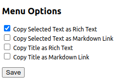

# Rich Text Copy

"Rich Text Copy" is a Chrome extension that allows users to quickly copy selected text or, if no text is selected, the title of a tab as a rich-text hyperlink or a markdown link. With just a simple right-click, you can transform your text selections into clickable links, ready for sharing.

Note: This extension works only on web pages that start with http:// or https://.

### Options

On the Options page, you can independently choose how to copy content: either as a rich-text hyperlink or a markdown link for both selected text and the title of the tab."

## Released version

You can also find the released version on [Chrome Web Store](https://chrome.google.com/webstore/detail/rich-text-copy/aidldbbgafbfbooldgdpbpgkabdojfge).

## How to Use

1. **Install Extension**:
   Install the "Rich Text Copy" extension to your Chrome browser.

2. **Select Text**:
   Highlight the text you want to share on any webpage.

3. **Right Click**:
   Right-click on the selected text, and in the context menu, click on "Copy as Rich Text".

4. **Paste Anywhere**:
   Paste the copied content into any platform that supports rich text, like Slack, Microsoft Teams, etc. The text will appear as a hyperlink pointing back to the original page. If the platform doesn't support rich text, only the selected text will be pasted.

# How to install

- Download the folder of change-website-lang/.
- Go to chrome://extensions/, turn on Developer mode.
- Click Load unpacked
- Find and select the folder
- See https://support.google.com/chrome/a/answer/2714278?hl=en
